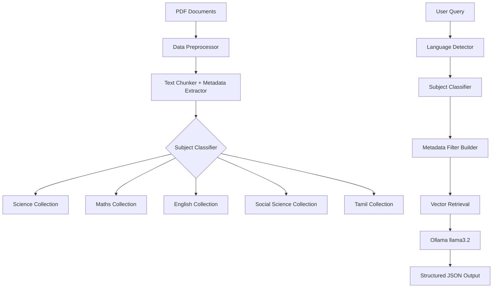

# School Tutor RAG System - Implementation Plan

Build a multilingual RAG system for 7th-grade school tutoring with subject-specific vector databases, metadata filtering, and structured JSON output.

## User Review Required

> [!IMPORTANT]
> This plan assumes **Ollama** is already installed locally with `llama3.2` and `mxbai-embed-large` models available. Please confirm these are set up before proceeding.

> [!NOTE]
> The system will use **FAISS** as the vector store for high-performance, subject-specific collections with metadata filtering support.

---

## Architecture Overview



---

## Proposed Changes

### Core Module - Configuration & Setup

#### [NEW] [config.py](file:///d:/school_tutor/config.py)
- Configuration constants for models, paths, and parameters
- Subject mappings and metadata schema definitions
- Embedding and LLM model configurations

#### [NEW] [requirements.txt](file:///d:/school_tutor/requirements.txt)
- Dependencies: langchain, langchain-community, faiss-cpu, pypdf, langdetect, ollama

---

### Data Processing Module

#### [NEW] [src/data_processor.py](file:///d:/school_tutor/src/data_processor.py)
- PDF text extraction with PyPDF
- Metadata extraction from filename patterns (e.g., `7th_Science_Term_II_EM.pdf`)
- Text chunking with configurable size and overlap (1000 chars, 200 overlap)
- Chapter and topic detection from PDF structure

#### [NEW] [src/metadata_extractor.py](file:///d:/school_tutor/src/metadata_extractor.py)
- Parse filename for subject, grade, term, language
- Content-type classification (theory, examples, exercises)
- Hierarchical metadata generation (chapter → topic → subtopic)

---

### Vector Store Module

#### [NEW] [src/vector_store.py](file:///d:/school_tutor/src/vector_store.py)
- FAISS integration with persistent storage
- Subject-specific indices (science_index, maths_index, etc.)
- mxbai-embed-large embedding via Ollama
- Batch document ingestion with progress tracking
- Efficient similarity search with metadata filtering

#### [NEW] [src/ingest.py](file:///d:/school_tutor/src/ingest.py)
- Main ingestion script to process all PDFs
- Create/update vector stores per subject
- Metadata indexing for efficient filtering

---

### RAG Pipeline Module

#### [NEW] [src/language_detector.py](file:///d:/school_tutor/src/language_detector.py)
- Detect query language (English/Tamil)
- Tamil Unicode character detection
- Language-aware prompt generation

#### [NEW] [src/query_classifier.py](file:///d:/school_tutor/src/query_classifier.py)
- Classify query intent and subject
- Build metadata filters based on classification
- Handle multi-subject queries

#### [NEW] [src/rag_chain.py](file:///d:/school_tutor/src/rag_chain.py)
- Main RAG pipeline with LangChain
- Context retrieval with metadata filtering
- Ollama llama3.2 integration for response generation
- Structured JSON output formatting

---

### Output Formatting Module

#### [NEW] [src/output_formatter.py](file:///d:/school_tutor/src/output_formatter.py)
- JSON schema for structured responses
- Subject-specific formatting rules
- Generate summary, caption, bullet_points, table
- Language-consistent output (respond in query language)

---

### Main Application

#### [NEW] [main.py](file:///d:/school_tutor/main.py)
- CLI interface for the tutor system
- Query input and processing
- Response display with formatted JSON

---

## Key Implementation Details

### Metadata Schema
```json
{
  "text": "content chunk...",
  "metadata": {
    "subject": "Science|Maths|English|Social_Science|Tamil",
    "sub_subject": "Chemistry|Physics|Algebra|Grammar|...",
    "grade": "7",
    "term": "I|II|III",
    "chapter": "chapter name",
    "topic": "topic name",
    "content_type": "theory|example|exercise",
    "language": "English|Tamil",
    "source_file": "filename.pdf",
    "page_number": 1
  }
}
```

### Subject Detection from Filename
| Filename Pattern | Subject | Language |
|------------------|---------|----------|
| `*_Science_*_EM.pdf` | Science | English |
| `*_Science_*_TM.pdf` | Science | Tamil |
| `*_Maths_*_EM.pdf` | Maths | English |
| `*_Social_Science_*` | Social_Science | Based on suffix |
| `*_English_*` | English | English |
| `*_Tamil_*` | Tamil | Tamil |

### Structured Output Schema (General Subjects)
```python
{
    "summary": str,           # Comprehensive answer summary
    "caption": str,           # Short title for the response
    "bullet_points": [        # Key points as list
        {"point": str}
    ],
    "table": [                # Tabular data if applicable
        {
            "header": str,
            "rows": [{"property": str, "value": str}]
        }
    ]
}
```

### Math-Specific Step-by-Step Output Schema
For math questions and problems, responses use a step-by-step format with detailed explanations:
```python
{
    "problem": str,           # The original problem statement
    "caption": str,           # Title (e.g., "Solving Quadratic Equation")
    "steps": [
        {
            "step_number": int,
            "action": str,        # What we're doing in this step
            "explanation": str,   # Why we're doing this step
            "expression": str,    # The mathematical expression/result
            "result": str         # Intermediate result (if applicable)
        }
    ],
    "final_answer": str,      # The final solution
    "concept_used": [str],    # Mathematical concepts applied
    "tips": [str]             # Helpful tips for similar problems
}
```

**Example Math Response:**
```json
{
  "problem": "Solve: 2x + 5 = 15",
  "caption": "Solving Linear Equation",
  "steps": [
    {
      "step_number": 1,
      "action": "Subtract 5 from both sides",
      "explanation": "To isolate the variable term, we remove the constant from the left side",
      "expression": "2x + 5 - 5 = 15 - 5",
      "result": "2x = 10"
    },
    {
      "step_number": 2,
      "action": "Divide both sides by 2",
      "explanation": "To find the value of x, we divide by the coefficient of x",
      "expression": "2x ÷ 2 = 10 ÷ 2",
      "result": "x = 5"
    }
  ],
  "final_answer": "x = 5",
  "concept_used": ["Linear equations", "Inverse operations"],
  "tips": ["Always perform the same operation on both sides", "Isolate the variable step by step"]
}
```

---

## Verification Plan

### Automated Tests

1. **Unit Tests for Data Processing**
   ```powershell
   cd d:\school_tutor
   python -m pytest tests/test_data_processor.py -v
   ```

2. **Integration Test for Vector Store**
   ```powershell
   python -m pytest tests/test_vector_store.py -v
   ```

3. **RAG Pipeline Test**
   ```powershell
   python -m pytest tests/test_rag_chain.py -v
   ```

### Manual Verification

1. **Ingest Sample Data**
   ```powershell
   cd d:\school_tutor
   python src/ingest.py
   ```
   - Verify all PDFs are processed
   - Check vector stores are created in `d:\school_tutor\vector_stores\`

2. **Test English Query**
   ```powershell
   python main.py
   # Enter: "What are the properties of alcohol?"
   ```
   - Verify response is in English
   - Verify it retrieves from Science collection
   - Verify structured JSON output format

3. **Test Tamil Query**
   ```powershell
   python main.py
   # Enter: "மது பற்றிய பண்புகள் என்ன?" (What are the properties of alcohol?)
   ```
   - Verify response is in Tamil
   - Verify retrieval from Tamil Science collection

4. **Test Subject-Specific Retrieval**
   - Ask a Maths question → should retrieve from Maths collection
   - Ask a Science question → should retrieve from Science collection
   - Verify via verbose logging in the console
